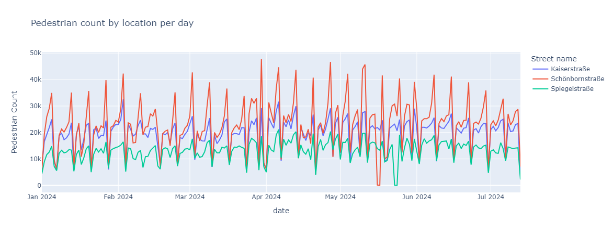

# FinalProject_EnterpriseAI

Final Project Group 5

Group members: Michael Baals, Katja Gegg, Oryna Hedrovych

## Overview
This final project was created as part of the course "Enterprise AI" by Group 5.
It implements an end-to-end machine learning pipeline to predict the pedestrian count on three streets in Würzburg for the next 24 hours.

The data that is used in this repository is retrieved from the<a href="https://opendata.wuerzburg.de/explore/dataset/passantenzaehlung_stundendaten/information/"> open data portal </a>, which provides different data sources about Wuerzburg.

### Prerequisites
Python 3.8 up to 3.11

## Pipeline

In our project, we use three pipelines: feature_engineering_pipeline, training_pipeline and inference_pipeline.

## Pipeline: feature_engineering_pipeline
The pipeline consists of the following steps:
- update_data: It will fetch the data from the open data portal and save it to the SQLite database
- load_data: It will load the data from the SQLite database
- create_derived_features: Creates new features from the existing data like "year", "month", "day", "hour" and "weekday".
- split_data: This step splits the dataframe into train and test as well as into input and output
- create_preprocessing_pipeline: Sets up the preprocessing steps required for the data.
- feature_preprocessor: Applies the preprocessing steps to the data.
- create_eda_data: Prepares the data that will be used by exploratory data analysis.

## Pipeline: training_pipeline
The pipeline consists of the following steps:
- hp_tuning: Performs hyperparameter tuning to find the best model parameters.
- model_trainer: Trains the model using the training data.
- evaluate_model: Evaluates the model's performance on the test data.

## Pipeline: inference_pipeline
The pipeline consists of the following steps:
- inference_data_loader: Loads the data required for making predictions.
- inference_preprocessing: Preprocesses the data for inference.
- prediction_service_loader: Loads the trained prediction service.
- predictor: Makes predictions using the trained model.

## Folders

- **data**: This folder contains raw data and data for Exploratory Data Analysis (EDA).
- **images**: This folder contains images generated during the EDA.

## EDA Notebook

The `EDA` notebook includes the Exploratory Data Analysis of data before and after preprocessing. It covers:
- Data Understanding
- Summary Statistics
- Visualization of the Analysis

## Files

__init__.py: This special file is used to import all the functions from the steps folder. 

__run__.py: Is used to start our pipeline

## Main File

The main file (`main.py` or equivalent) sets up zenML and runs the pipeline. It involves the following components:

| COMPONENT_TYPE     | COMPONENT_NAME           |
|--------------------|--------------------------|
| EXPERIMENT_TRACKER | wandb_experiment_tracker |
| ORCHESTRATOR       | default                  |
| ARTIFACT_STORE     | default                  |

## View Pipeline Results

The results of the pipeline runs can be viewed at<a href="https://wandb.ai/ss24_eai"> Link to Results </a>.